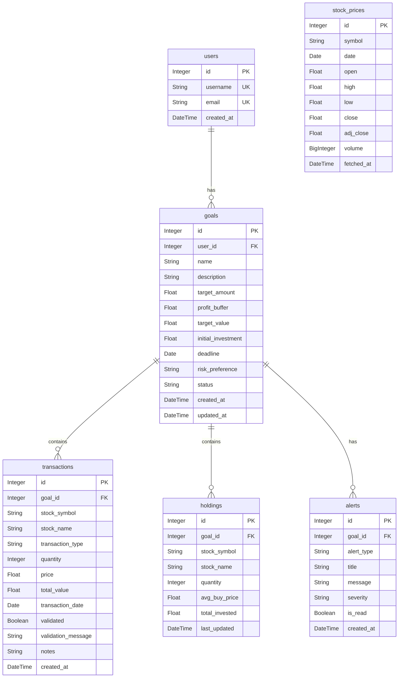

# Database Schema Documentation

This document outlines the database schema for the Stock Portfolio Advisory System. The system uses a relational database (SQLite by default) with SQLAlchemy ORM.

## Overview

The database consists of the following main tables:
- **users**: Stores user account information.
- **goals**: Manages financial goals for each user.
- **transactions**: Records stock buy/sell operations linked to specific goals.
- **holdings**: Tracks current stock positions for each goal.
- **stock_prices**: Caches historical stock price data.
- **alerts**: Stores notifications and warnings for users.

## Entity Relationship Diagram (ERD)

## Detailed Schema

### 1. Users Table (`users`)
Stores user authentication and profile details.

| Column | Type | Constraints | Description |
| :--- | :--- | :--- | :--- |
| `id` | Integer | PK, Index | Unique identifier for the user. |
| `username` | String(50) | Unique, Not Null, Index | User's unique username. |
| `email` | String(100) | Unique, Not Null | User's email address. |
| `created_at` | DateTime | Default: `now()` | Timestamp when the user was created. |

### 2. Goals Table (`goals`)
Represents specific financial objectives created by users.

| Column | Type | Constraints | Description |
| :--- | :--- | :--- | :--- |
| `id` | Integer | PK, Index | Unique identifier for the goal. |
| `user_id` | Integer | FK(`users.id`), Not Null | The user who owns this goal. |
| `name` | String(100) | Not Null | Name of the goal (e.g., "Retirement"). |
| `description` | String(500) | Nullable | Detailed description of the goal. |
| `target_amount` | Float | Not Null | The target monetary amount to reach. |
| `profit_buffer` | Float | Default: `0.10` | Percentage buffer for profit (e.g., 0.10 for 10%). |
| `target_value` | Float | Nullable | Calculated target (`target_amount * (1 + profit_buffer)`). |
| `initial_investment` | Float | Default: `0.0` | Initial capital allocated to this goal. |
| `deadline` | Date | Not Null | Target date to achieve the goal. |
| `risk_preference` | String(20) | Default: `moderate` | Risk level: `low`, `moderate`, `high`. |
| `status` | String(20) | Default: `active` | Status: `active`, `achieved`, `cancelled`. |
| `created_at` | DateTime | Default: `now()` | Creation timestamp. |
| `updated_at` | DateTime | Default: `now()` | Last update timestamp. |

### 3. Transactions Table (`transactions`)
Records individual buy or sell actions for stocks within a goal.

| Column | Type | Constraints | Description |
| :--- | :--- | :--- | :--- |
| `id` | Integer | PK, Index | Unique identifier for the transaction. |
| `goal_id` | Integer | FK(`goals.id`), Not Null | The goal this transaction belongs to. |
| `stock_symbol` | String(20) | Not Null, Index | Ticker symbol of the stock. |
| `stock_name` | String(100) | Nullable | Full name of the company. |
| `transaction_type`| String(10) | Not Null | Type of transaction: `buy` or `sell`. |
| `quantity` | Integer | Not Null | Number of shares involved. |
| `price` | Float | Not Null | Price per share at the time of transaction. |
| `total_value` | Float | Nullable | Total value (`quantity * price`). |
| `transaction_date`| Date | Not Null | Date of the transaction. |
| `validated` | Boolean | Default: `False` | Whether the transaction has been validated. |
| `validation_message`| String(200)| Nullable | Message regarding validation status. |
| `notes` | String(500) | Nullable | Optional user notes. |
| `created_at` | DateTime | Default: `now()` | Record creation timestamp. |

### 4. Holdings Table (`holdings`)
Aggregates transactions to show the current portfolio state per goal.

| Column | Type | Constraints | Description |
| :--- | :--- | :--- | :--- |
| `id` | Integer | PK, Index | Unique identifier for the holding. |
| `goal_id` | Integer | FK(`goals.id`), Not Null | The goal this holding is part of. |
| `stock_symbol` | String(20) | Not Null, Index | Ticker symbol. |
| `stock_name` | String(100) | Nullable | Company name. |
| `quantity` | Integer | Not Null, Default: `0` | Current number of shares held. |
| `avg_buy_price` | Float | Not Null, Default: `0.0` | Average purchase price per share. |
| `total_invested` | Float | Default: `0.0` | Total money invested in this holding. |
| `last_updated` | DateTime | Default: `now()` | Timestamp of last update. |

### 5. Stock Prices Table (`stock_prices`)
Stores historical stock market data for analysis and charts.

| Column | Type | Constraints | Description |
| :--- | :--- | :--- | :--- |
| `id` | Integer | PK, Index | Unique identifier. |
| `symbol` | String(20) | Not Null, Index | Stock ticker symbol. |
| `date` | Date | Not Null, Index | Market date. |
| `open` | Float | Nullable | Opening price. |
| `high` | Float | Nullable | Highest price of the day. |
| `low` | Float | Nullable | Lowest price of the day. |
| `close` | Float | Nullable | Closing price. |
| `adj_close` | Float | Nullable | Adjusted closing price. |
| `volume` | BigInteger | Nullable | Trading volume. |
| `fetched_at` | DateTime | Default: `now()` | When this data was fetched. |

### 6. Alerts Table (`alerts`)
System notifications regarding goals or market conditions.

| Column | Type | Constraints | Description |
| :--- | :--- | :--- | :--- |
| `id` | Integer | PK, Index | Unique identifier. |
| `goal_id` | Integer | FK(`goals.id`), Not Null | Related goal. |
| `alert_type` | String(50) | Not Null | Type: `goal_progress`, `risk_warning`, etc. |
| `title` | String(200) | Not Null | Alert title. |
| `message` | String(1000)| Nullable | Detailed alert message. |
| `severity` | String(20) | Default: `info` | Level: `info`, `warning`, `critical`. |
| `is_read` | Boolean | Default: `False` | Read status. |
| `created_at` | DateTime | Default: `now()` | Creation timestamp. |
